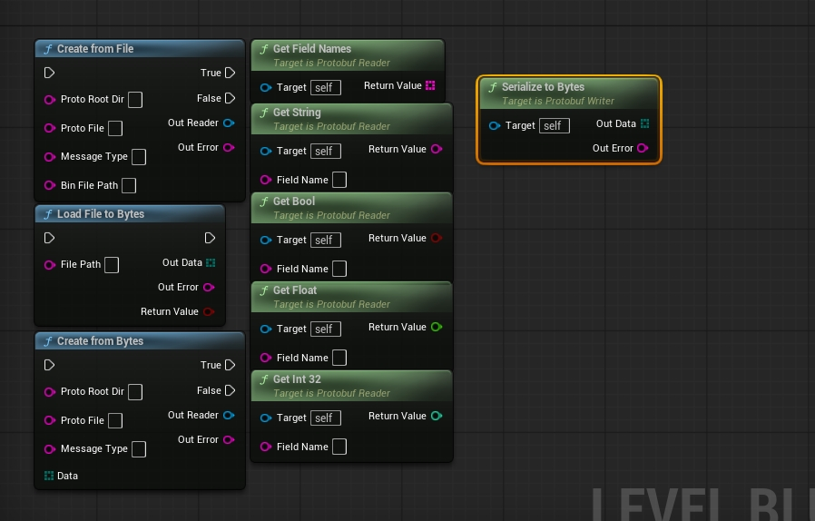

# ProtobufRuntime

UE5 插件，支持在运行时动态加载和读取 `.proto` 文件，无需代码生成，无需预编译二进制文件。Protobuf 37.0.0-dev 源码直接编译进插件。

> **平台支持**：仅在 **UE 5.6 / Windows x64 / MSVC** 下编译测试通过。其他平台和引擎版本未经验证，移植时可能需要额外处理警告抑制、导出宏和文件路径等问题。



---

## 功能概述

- 运行时从磁盘加载任意 `.proto` 描述文件
- 通过反射（`DynamicMessage`）解析 protobuf 二进制数据
- 在蓝图或 C++ 中按字段名读取数据
- 无需执行 `protoc`，无需生成 `.pb.h / .pb.cc` 文件

---

## 插件结构

```
ProtobufRuntime/
├── Source/
│   ├── ProtobufLib/              # 负责编译 protobuf + abseil 源码
│   │   ├── ProtobufLib.Build.cs
│   │   └── Private/
│   │       ├── ProtobufModule.cpp
│   │       └── protobuf_src/     # 222 个 wrapper .cpp（每个 .cc 对应一个）
│   ├── ProtobufRuntime/          # UE 模块，暴露 UProtobufReader
│   │   ├── ProtobufRuntime.Build.cs
│   │   ├── Public/
│   │   │   └── ProtobufReader.h
│   │   └── Private/
│   │       └── ProtobufReader.cpp
│   └── ThirdParty/
│       └── protobuf/             # protobuf 37.0.0-dev 源码（src/ + third_party/）
└── ProtobufRuntime.uplugin
```

`ProtobufLib` 是纯 C++ 模块，负责所有第三方代码的编译。`ProtobufRuntime` 只包含面向 UE 的 API，依赖 `ProtobufLib`。

---

## 安装配置

在 ThirdParty 目录下克隆 protobuf（含子模块）。当前随插件提供的源码自报版本为 Protobuf 37.0.0-dev；如需可复现构建，应使用与插件内源码一致的上游开发版本提交。

```bash
cd Plugins/ProtobufRuntime/Source/ThirdParty
git clone https://github.com/protocolbuffers/protobuf.git protobuf --recursive
```

克隆完成后目录结构应为：
```
ThirdParty/protobuf/
├── src/google/protobuf/      ← 头文件和 .cc 源码
├── third_party/abseil-cpp/   ← absl 依赖
└── third_party/utf8_range/   ← UTF-8 校验
```

然后右键 `.uproject` → **Generate Visual Studio project files**，再编译即可。

---

## 蓝图 API

### Writer — `UProtobufWriter`

#### `Create`
创建一个空消息，准备写入字段。

| 引脚 | 类型 | 说明 |
|------|------|------|
| ProtoRootDir | String | 存放 `.proto` 文件的目录 |
| ProtoFile | String | `.proto` 的相对路径 |
| MessageType | String | protobuf 消息的完整限定名，如 `game.PlayerInfo` |
| **OutWriter** | UProtobufWriter | 成功时返回可用对象，失败时为 null |
| **OutError** | String | 失败时的错误描述 |

`MessageType` 填写 protobuf 消息的完整限定名，不是 `.proto` 文件名，也不是生成的 C++ 类名。它由 `package` 和 `message` 名组成：

```proto
package game;
message PlayerInfo {}
```

上述定义应填写 `game.PlayerInfo`。如果没有声明 `package`，则填写 `PlayerInfo`。如果是嵌套消息，例如 `message Player { message Inventory {} }`，则填写 `game.Player.Inventory`。

#### 字段写入节点（在 OutWriter 对象上调用）

| 节点 | 输入 | 说明 |
|------|------|------|
| `SetString(FieldName, Value)` | String | 字段名或类型不匹配时返回 false |
| `SetInt32(FieldName, Value)` | Int32 | 字段名或类型不匹配时返回 false |
| `SetFloat(FieldName, Value)` | Float | 字段名或类型不匹配时返回 false |
| `SetBool(FieldName, Value)` | Bool | 字段名或类型不匹配时返回 false |
| `Clear()` | — | 重置所有字段为默认值 |

#### 序列化

| 节点 | 说明 |
|------|------|
| `SaveToFile(FilePath, OutError)` | 序列化并写入 `.bin` 文件 |
| `SerializeToBytes(OutData, OutError)` | 序列化为字节数组（用于网络传输等） |

---

### Reader — `UProtobufReader`

### `CreateFromFile`
从磁盘读取 `.bin` 文件并一步完成解析，最常用。

| 引脚 | 类型 | 说明 |
|------|------|------|
| ProtoRootDir | String | 存放 `.proto` 文件的目录 |
| ProtoFile | String | `.proto` 的相对路径，如 `"player_info.proto"` |
| MessageType | String | 消息类型全名，如 `"game.PlayerInfo"` |
| BinFilePath | String | 二进制文件的绝对路径 |
| **OutReader** | UProtobufReader | 成功时返回可用对象，失败时为 null |
| **OutError** | String | 失败时的错误描述，成功时为空 |

### `CreateFromBytes`
解析已加载到内存中的字节数组。引脚与 `CreateFromFile` 相同，`BinFilePath` 替换为 `Data（字节数组）`。适合从网络接收数据后解析。

### `LoadFileToBytes`
将磁盘文件读取为字节数组，配合 `CreateFromBytes` 使用。

| 引脚 | 类型 | 说明 |
|------|------|------|
| FilePath | String | 文件的绝对路径 |
| **OutData** | Byte Array | 文件内容 |
| **OutError** | String | 失败时的错误描述 |
| **返回值** | Bool | 成功返回 true |

### 字段读取节点（在 OutReader 对象上调用）

| 节点 | 返回类型 | 说明 |
|------|----------|------|
| `GetString(FieldName)` | String | 字段不存在时返回 `""` |
| `GetInt32(FieldName)` | Int32 | 字段不存在时返回 `0` |
| `GetFloat(FieldName)` | Float | 字段不存在时返回 `0.0` |
| `GetBool(FieldName)` | Bool | 字段不存在时返回 `false` |
| `HasField(FieldName)` | Bool | 检查字段是否存在于 schema 中 |
| `GetFieldNames()` | String Array | 返回该消息所有字段名 |

---

## 蓝图快速上手

**写入**
```
[Create (Writer)]
  ProtoRootDir = "C:/MyProject/Content/Protobuf"
  ProtoFile    = "player_info.proto"
  MessageType  = "game.PlayerInfo"
        |
   OutWriter ──→ SetString "player_name"    "NewPlayer"
             ──→ SetInt32  "level"          10
             ──→ SetFloat  "health"         500.0
             ──→ SetBool   "is_online"      true
             ──→ SaveToFile "C:/Save/player.bin"
```

**读取**
```
[CreateFromFile]
  ProtoRootDir  = "C:/MyProject/Content/Protobuf"
  ProtoFile     = "player_info.proto"
  MessageType   = "game.PlayerInfo"
  BinFilePath   = "C:/Save/player.bin"
        |
   OutReader ──→ [GetString] FieldName="player_name"  → "NewPlayer"
             ──→ [GetInt32]  FieldName="level"         → 10
             ──→ [GetFloat]  FieldName="health"        → 500.0
             ──→ [GetBool]   FieldName="is_online"     → true
   OutError  ──→ （空字符串表示成功）
```

如果 `OutReader` 为 null，打印 `OutError` 查看错误原因。

---

## C++ 快速上手

**写入**
```cpp
#include "ProtobufWriter.h"

FString Error;
UProtobufWriter* Writer = nullptr;

UProtobufWriter::Create(
    TEXT("C:/MyProject/Content/Protobuf"),
    TEXT("player_info.proto"),
    TEXT("game.PlayerInfo"),
    Writer, Error);

if (Writer)
{
    Writer->SetString(TEXT("player_name"), TEXT("NewPlayer"));
    Writer->SetInt32(TEXT("level"), 10);
    Writer->SetFloat(TEXT("health"), 500.f);
    Writer->SetBool(TEXT("is_online"), true);
    Writer->SaveToFile(TEXT("C:/Save/player.bin"), Error);
}
```

**读取**
```cpp
#include "ProtobufReader.h"

FString Error;
UProtobufReader* Reader = nullptr;

UProtobufReader::CreateFromFile(
    TEXT("C:/MyProject/Content/Protobuf"),
    TEXT("player_info.proto"),
    TEXT("game.PlayerInfo"),
    TEXT("C:/MyProject/Content/Protobuf/player_1.bin"),
    Reader,
    Error);

if (!Reader)
{
    UE_LOG(LogTemp, Error, TEXT("Protobuf 加载失败: %s"), *Error);
    return;
}

FString Name   = Reader->GetString(TEXT("player_name"));  // "HeroKnight"
int32   Level  = Reader->GetInt32(TEXT("level"));          // 42
float   HP     = Reader->GetFloat(TEXT("health"));         // 850.5
bool    Online = Reader->GetBool(TEXT("is_online"));       // true
```

---

## 生成测试数据（Python）

安装依赖：
```bash
pip install grpcio-tools
```

运行项目根目录的脚本：
```bash
python gen_proto_testdata.py
```

生成到 `Content/Protobuf/`：

| 文件 | 内容 |
|------|------|
| `player_info.proto` | 玩家信息消息定义 |
| `player_1/2/3.bin` | 三条玩家数据（名字、等级、血量、职业…） |
| `room_config.proto` | 房间/关卡配置消息定义 |
| `room_1/2/3.bin` | 三条房间数据（地图名、重力、时间限制…） |

---

## 接入自己的 .proto

1. 用 `proto3` 语法编写 schema，使用 `int32`、`float`、`string`、`bool` 字段
2. 将 `.proto` 文件放在运行时可访问的目录
3. 用 Python / Go / 任意语言的 protobuf 库序列化数据为 `.bin`
4. 调用 `CreateFromFile` 或 `CreateFromBytes`

**全程无需重新编译引擎或插件**，schema 在运行时动态加载。

---

## 支持的字段类型

| proto3 类型 | 对应蓝图节点 |
|-------------|-------------|
| `string` | `GetString` |
| `int32` | `GetInt32` |
| `float` | `GetFloat` |
| `bool` | `GetBool` |

repeated 字段、嵌套消息、枚举、`int64`、`double`、`bytes` 目前未在蓝图 API 中暴露。底层 `DynamicMessage` 支持这些类型，如有需要可以自行扩展 `ProtobufReader.h/.cpp`。

---

## 注意事项

- `UProtobufReader` 是 `UObject`，生命周期由 GC 管理。如需跨帧持有，必须用 `UPROPERTY` 标记，否则可能被回收
- protobuf 头文件**只能出现在 `.cpp` 文件中**，不要放进 Public 头文件，否则会污染其他 UE 编译单元
- 如果 `.proto` 文件通过 `import` 引用了其他 `.proto`，`ProtoRootDir` 必须包含所有被引用的文件
- 模块命名为 `ProtobufLib` 而非 `Protobuf`，是为了避免与 UE5 引擎内置的 Protobuf v21.1（MetaHuman SDK 使用）产生命名冲突

---

## 编译说明

- 两个模块均设置 `bUseUnity = false`，原因：protobuf 的 `port_def.inc` / `port_undef.inc` 要求每个 `.cc` 必须在独立编译单元中展开
- `ProtobufLib` 设置 `PCHUsage = NoPCHs`，原因相同
- 222 个 wrapper 文件统一禁用以下 MSVC 警告：`4100 4127 4141 4146 4065 4191 4244 4267 4305 4310 4312 4456 4457 4554 4661 4701 4702 4800 4855 4946`
- DLL 导出/导入配置：`LIBPROTOBUF_EXPORTS` / `LIBPROTOC_EXPORTS` / `ABSL_BUILD_DLL` 为 PrivateDefinitions；`PROTOBUF_USE_DLLS` / `ABSL_CONSUME_DLL` 为 PublicDefinitions

---

## 第三方库许可证

| 库 | 版本 | 许可证 |
|----|------|--------|
| [protobuf](https://github.com/protocolbuffers/protobuf) | 37.0.0-dev | BSD 3-Clause |
| [abseil-cpp](https://github.com/abseil/abseil-cpp) | lts_20240116 | Apache 2.0 |
| [utf8_range](https://github.com/protocolbuffers/utf8_range) | 随 protobuf 附带 | MIT |
